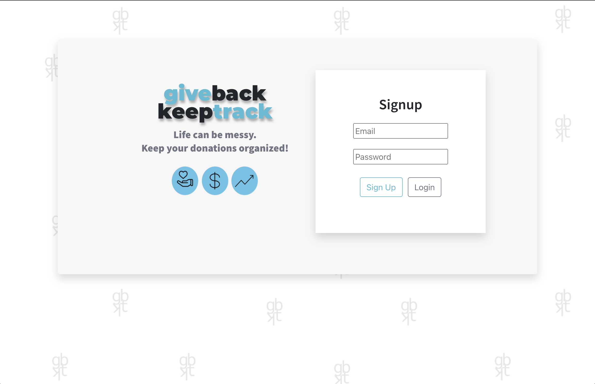
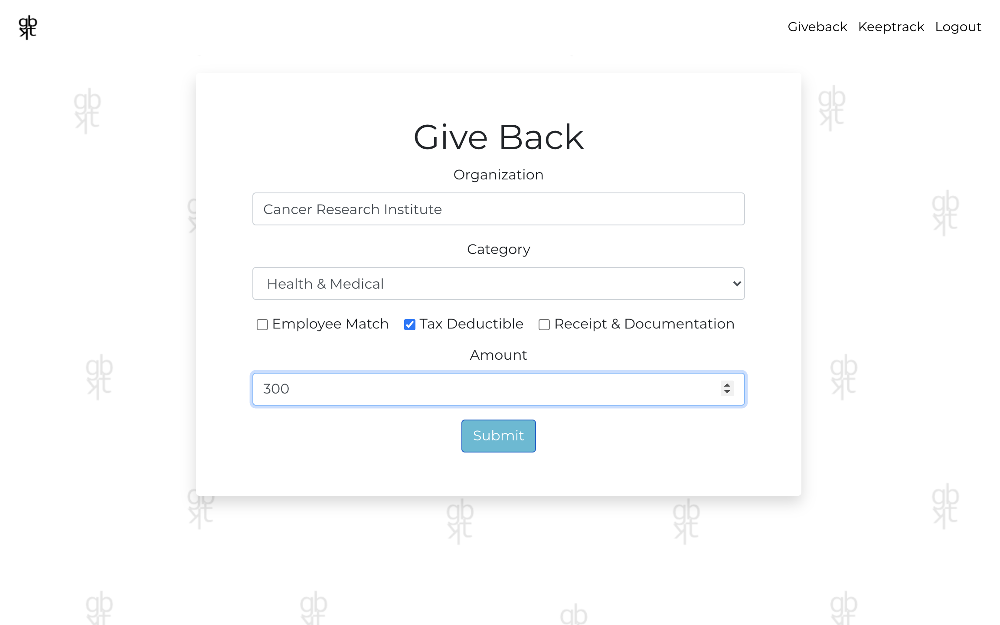

# GiveBack KeepTrack

Deployed Heroku link: https://frozen-river-69538.herokuapp.com/

## Description
GiveBack KeepTrack is a full stack application built with React JS. Users can keep track of their charitable donations throughout the year, including details such as category, tax deducible, employer matched, and receipts/documentation. [Link to the deployed application]

## Table of Contents
* [Installation](#installation)
* [Usage](#usage)
* [Screenshot](#screenshot)
* [License](#license)
* [Contributing](#contributing)
* [Tests](#tests)
* [Questions](#questions)
  
## Installation
Install npm packages as usual, and all dependencies.

## Usage
After installing all depenencies, start the server. Then, open the app in your browser. As it is, you'll use local host 3000 for the front end; the back end uses 3001.

## Screeshots

## License
MIT License

    Copyright (c) 2021 Alexandra Hionis, Suzy Givnish, & Alison Lubar
    
    Permission is hereby granted, free of charge, to any person obtaining a copy
    of this software and associated documentation files (the "Software"), to deal
    in the Software without restriction, including without limitation the rights
    to use, copy, modify, merge, publish, distribute, sublicense, and/or sell
    copies of the Software, and to permit persons to whom the Software is
    furnished to do so, subject to the following conditions:
    
    The above copyright notice and this permission notice shall be included in all
    copies or substantial portions of the Software.
    
    THE SOFTWARE IS PROVIDED "AS IS", WITHOUT WARRANTY OF ANY KIND, EXPRESS OR
    IMPLIED, INCLUDING BUT NOT LIMITED TO THE WARRANTIES OF MERCHANTABILITY,
    FITNESS FOR A PARTICULAR PURPOSE AND NONINFRINGEMENT. IN NO EVENT SHALL THE
    AUTHORS OR COPYRIGHT HOLDERS BE LIABLE FOR ANY CLAIM, DAMAGES OR OTHER
    LIABILITY, WHETHER IN AN ACTION OF CONTRACT, TORT OR OTHERWISE, ARISING FROM,
    OUT OF OR IN CONNECTION WITH THE SOFTWARE OR THE USE OR OTHER DEALINGS IN THE
    SOFTWARE.

## Contributing

* **[Alison Lubar]** 
* **Alexandra Hionis** 
* **[Suzanne Givnish](https://github.com/suzygiv)** 

## Tests
None yet.

## Questions
Any questions can be directed to us, found at the following: 
 Alexandra Hionis
 GitHub: https://github.com/Alexandra-Hionis
 Email: alexandra.hionis@gmail.com
 Suzy Givnish
 GitHub: https://github.com/suzygiv
 Email: suzannegivnish@gmail.com
 Alison Lubar
 GitHub: https://github.com/theoriginalison
 Email: aslubar@gmail.com
